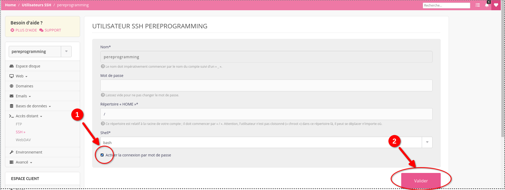
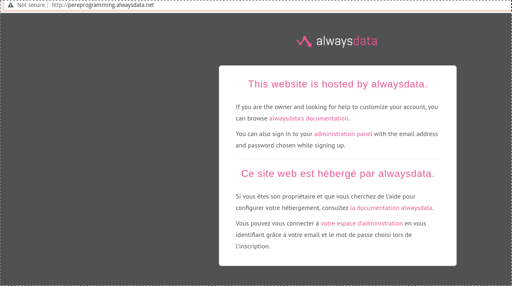
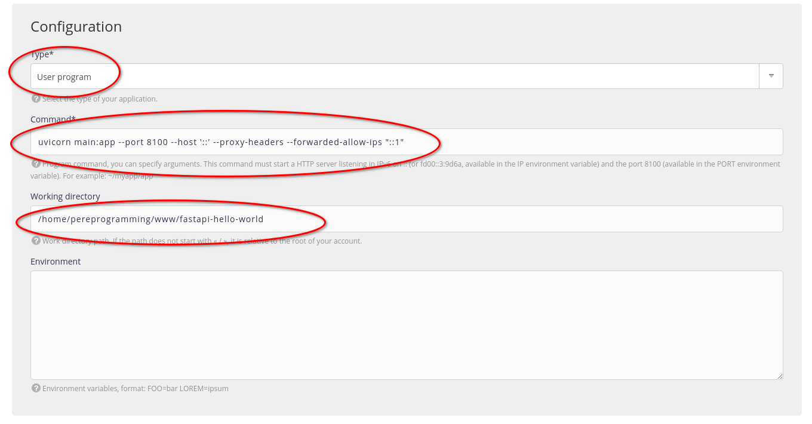

__TL;DR__ C'est simple, ça fonctionne sans problème et le support d'[Alwaysdata](https://www.alwaysdata.com) est au top.

## Pré-requis

- Un compte (gratuit ou payant) chez [Alwaysdata](https://www.alwaysdata.com)
- Une application fastapi prête à être déployée en utilisant [Uvicorn](https://www.uvicorn.org/)
- Des connaissance de base en SSH et git

## Déploiement du site

Nous allons partir du fait que votre site est sur un dépôt Git quelque part sur l'internet mondial et que nous allons le déployer via SSH. Vous pouvez aussi l'envoyer [via FTP](https://help.alwaysdata.com/fr/acc%C3%A8s-distant/ftp/), il en faut pour tous les goûts après tout, et je ne vous jugerai pas pour cela, promis.

### Connexion SSH

Tout d'abord, connectons-nous avec un mot de passe au serveur SSH Alwaysdata. Attention à bien activer la connexion par mot de passe pour l'utilisateur par défaut comme indiqué ci-dessous.

[](images/always_data_ssh_1.png)

[](images/always_data_ssh_2.png)

Vous pouvez à la place [utiliser une clé SSH](https://help.alwaysdata.com/fr/acc%C3%A8s-distant/ssh/utiliser-des-cl%C3%A9s-ssh/) si vous le souhaitez.

Par défaut, la connexion ssh se fait via `ssh [utilisateur]@ssh-[compte].alwaysdata.net`. Dans mon cas, le nom de l'utilisateur SSH et du compte Alwaysdata sont les mêmes, c'est à dire `pereprogramming`. Ce qui donne:

```bash
ssh -A pereprogramming@ssh-pereprogramming.alwaysdata.net
```

Notez le `-A` que j'ai rajouté dans la commande SSH. Il va nous permettre de transférer notre clée SSH locale sur le serveur (en session) et va nous permettre de faire des commandes git sur l

Vous devriez arriver sur un truc de ce style :

```bash
➜  pereprogramming git:(main) ✗ ssh pereprogramming@ssh-pereprogramming.alwaysdata.net
(pereprogramming@ssh-pereprogramming.alwaysdata.net) Password:
Linux ssh1 5.4.30-alwaysdata #1 SMP Fri Apr 3 15:02:12 UTC 2020 x86_64

  * Any process using too much CPU, RAM or IO will get killed
  * Any process running for too long (e.g. days) will get killed
  * If you want to have cron jobs, use scheduled tasks: https://help.alwaysdata.com/en/tasks/
  * If you want to have processes running 24/7, use services: https://help.alwaysdata.com/en/services/

pereprogramming@ssh1:~$
```

### Récupération du site

Je vais prendre comme exemple un simple HelloWord de fastapi disponible sur [mon compte github](https://github.com/pereprogramming/fastapi-hello-world). Déployons le dans `~/www/` :

```bash
cd www
git clone https://github.com/pereprogramming/fastapi-hello-world.git
```

### Lancement d'Uvicorn

Avec Alwaysdata, pas besoin d'environnement virtuel, nous allons installer FastAPI directement et ses autres dépendances, notamment [Uvicorn](https://www.uvicorn.org/) :

```bash
pip install fastapi[all]
```

À ce stade, et pour peu que vous soyez bien dans le répertoire où votre code se situe (`cd ~/www/fastapi-hello-world` pour moi) vous devriez être capable de lancer `Uvicorn` directement avec la commande `uvicorn main:app --reload`. Vous devriez alors obtenir quelque chose comme cela :

```bash
pereprogramming@ssh1:~/www/fastapi-hello-world$ uvicorn main:app --reload
INFO:     Uvicorn running on http://127.0.0.1:8000 (Press CTRL+C to quit)
INFO:     Started reloader process [3561802] using watchgod
INFO:     Started server process [3561808]
INFO:     Waiting for application startup.
INFO:     Application startup complete.
```

Tout cela valide que notre installation fonctionne, mais si vous essayez de vous rendre sur l'url `http://[compte].alwaysdata.net/` vous verrez que notre application ne s'affiche pas.


[](images/site_heberge_par_always_data.png)


Pour cela, il va falloir configurer notre type de site sur Alwaysdata. Vous pouvez quitter le serveur `uvicorn`, c'était une fausse alerte :yum:

## Configuration du type de site

Par défaut, Alwaysdata s'attend à avoir un site en PHP. Ce n'est évidemment pas notre cas. Notre site n'est pas non plus un site « __Python WSGI__ » classique puisque notre application __FastAPI utilise forcément asyncio__ et n'est pas compatible avec WSGI. Nous allons donc devoir faire un type de site personnalisé, appelé « __programme utilisateur__ » chez Alwasdata. En gros, nous allons lancer le serveur web `uvicorn` et le faire écouter sur un port et un host particulier que le proxy d'Alwaysdata attend.

Voici la commande `uvicorn` à exécuter pour que ce la fonctionne :

```bash
uvicorn main:app --port 8100 --host '::' --proxy-headers --forwarded-allow-ips "::1"
```

- Le port `8100` est le port sur lequel le proxy Alwaysdata va rediriger les requêtes.
- `--host '::'` précise à `uvicorn` d'écouter les requêtes sur toutes les IPs (V6). C'est l'équivalent du `0.0.0.0` en IPV4. Il va nous permettre de recevoir les requêtes du proxy Alwaysdata.
- `proxy-headers` permet à `uvicorn` de recevoir les headers HTTPs qui sont envoyés au proxy Alwaysdata par le client web. Par défaut, `uvicorn` les rejette.
- `--forwarded-allow-ips ::1` précise à `uvicorn` à partir de quel host on accepte les requêtes qu'on nous redirige. `::1` en IPV6 correspond à `127.0.0.1` en ipv4.

Vérifiez bien que la commande fonctionne avant d'aller plus loin. Vous devriez obtenir quelque chose comme ça :

```bash
pereprogramming@ssh1:~/www/fastapi-hello-world$ uvicorn main:app --port 8100 --host '::' --proxy-headers --forwarded-allow-ips "::1"
INFO:     Started server process [1297268]
INFO:     Waiting for application startup.
INFO:     Application startup complete.
INFO:     Uvicorn running on http://[::]:8100 (Press CTRL+C to quit)
```

Une fois que c'est le cas, allez [modifier le type de site dans l'administration Alwaysdata sur « programme utilisateur »](https://help.alwaysdata.com/fr/sites/programme-utilisateur/).

[](images/type_de_site.png)

Remplissez ensuite la partie `Command` et `Working Directory` avec respectivement la commande `uvicorn` ci-dessus et le répertoire où se trouve votre code, `/home/pereprogramming/www/fastapi-hello-world` pour moi.


Vous devriez obtenir quelque chose comme cela :

[](images/type_de_site_programme_utilisateur_2.png)

## Tester et debugger

A priori, votre site devrait maintenant être fonctionnel.

[](images/site_ok.png)

Si ce n'est pas le cas, voici quelques éléments à savoir :
- Les fichiers de logs se trouvent dans `~/admin/logs/sites/`
- Lorsque vous faites une modification, n'oubliez pas de « rédémarrer » votre site dans l'administration Alwaysdata sinon vous ne verrez pas la modification.

N'hésitez pas [à me contacter sur Twitter](https://twitter.com/pereprogramming) si vous avez des questions.

Amusez-vous bien ! :tada:
