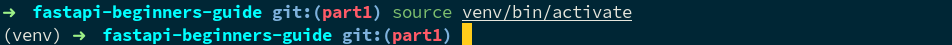
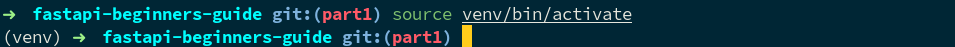

## Pourquoi FastAPI ?

Commençons par le commencement.

FastAPI est un framework de __développement Web__ écrit en Python. Il est très polyvalent et va permettre de développer :
- Des __sites internet « classiques »__ avec juste du contenu
- Des __sites dynamiques__ avec formulaires et gestion des utilisateurs
- La partie « cachée » des __applications mobiles iOS ou Android__, que l'on appelle une __API__. Vous entendrez aussi parler de __backend__, ce n'est pas tout à fait la même chose, mais on va faire comme-ci pour l'instant.
- Des applications en __temps réel__ comme peuvent l'être les applications de discussion, les cours de la bourse, etc. Vous entendrez souvent parler de __WebSocket__ pour ces applications, on y reviendra.
- Les interfaces d'accès des applications de __Machine Learning__ et d'__Intelligence Artificielle__ qui sont majoritairement développées en Python.

L'idée d'utiliser un framework va être de __ne pas réinventer la roue__ et de se baser sur ce que d'autres personnes talentueuses ont fait avant nous pour résoudre les problèmes classiques des applications web : gestion de la base de données, des URL, de la sécurité des formulaires, des sessions, etc.

FastAPI est un framework assez __récent__ puisque sa première version date de __décembre 2018__. C'est d'ailleurs pour cela que je le choisis maintenant pour la majorité de mes projets : il se base sur une __version récente de Python (minimum 3.6)__ et en tire tous les bénéfices que nous verrons un peu plus tard (simplicité et rapidité notamment).

Il est entre autres utilisé dans de __grosses entreprises__ comme [__Microsoft__](https://github.com/tiangolo/fastapi/pull/26#issuecomment-463768795), [__Uber__](https://eng.uber.com/ludwig-v0-2/) ou encore [__Netflix__](https://netflixtechblog.com/introducing-dispatch-da4b8a2a8072).

Et pourquoi pas __Django__ ou __framework X__ ? Tout simplement pour les raisons citées ci-dessus. __FastAPI__ est pour moi le [Framework d'avenir en Python](/articles/le-meilleur-framework-web-python/). Donc quitte à apprendre quelque chose, autant apprendre quelque chose sur lequel vous pourrez __capitaliser pour votre futur__ : FastAPI est parfait pour ça.

## Installation

### Installer Python 3.6+

Il va vous falloir une version récente de Python, a minima la 3.6. La manière de l'installer dépendra de votre système d'exploitation en fonction de si vous êtes sous Windows, Linux ou Mac OS X. Je ne vais pas rentrer dans les détails ici, mais l'idée est d'aller sur le [site officiel de Python](https://www.python.org/download/) et de télécharger puis installer la version la plus récente. À la date d'écriture de cet article c'est la version 3.9.5.

Il faudra que, dans votre terminal ou invite de commandes, la version de Python affichée avec la commande `python --version` soit celle que vous avez téléchargée. Dans mon cas :

```
$ python --version
Python 3.9.5
```

> __Attention__ : dans tous les exemples de code comme celui ci-dessus, les commandes commenceront toujours par `$` et le résultat sera le contenu des lignes en dessous.
>
> Dans les exemples qui seront donnés, ne tapez donc pas le `$` mais uniquement ce qui se trouve après, dans notre cas `python --version`


### Installer `pip` et `virtualenv`

Dans tout projet, vous allez avoir besoin de dépendances : des programmes ou des librairies développées par d'autres et mises à votre disposition. En Python, ces dépendances sont généralement gérées grâce à un logiciel nommé [`pip`](https://pip.pypa.io/en/stable/).

Tout d'abord, vérifiez si vous avez `pip` d'installé :

```
$ python -m pip --version
pip 20.3.1 from /usr/lib/python3.9/site-packages/pip (python 3.9)
```

Si vous l'avez, il vous affichera un numéro de version comme dans l'exemple ci-dessus (le numéro de version en lui-même n'est pas très important). Si ce n'est pas le cas, téléchargez le fichier `get-pip.py` et installez-le via Python :

```
$ sudo python get-pip.py
```

Maintenant que vous avez `pip` on va pouvoir installer un autre logiciel nommé `virtualenv`. `virtualenv` va permettre d'isoler votre projet et ses dépendances au sein d'un environnement dédié, séparé de votre environnement système. Cela va avoir l'avantage de __ne pas créer de conflits__ avec les versions et les dépendances Python de votre système, mais aura aussi l'avantage de rendre votre projet facilement utilisable/installable sur une autre machine.

```
$ sudo pip install virtualenv
```

Notez les `sudo` dans les deux commandes ci-dessus. Cela va installer `pip` et `virtualenv` au niveau de votre système d'exploitation.

Il est maintenant temps de créer notre premier environnement virtuel et notre premier projet. Créez un répertoire pour votre projet puis déplacez-vous dedans. Créez ensuite votre environnement virtuel avec la commande ci-dessous.

```
$ virtualenv venv -p python
```

Vous devriez obtenir un résultat de ce type :


Une fois votre environnement virtuel créé, il faut que vous l'activiez grâce à la commande suivante :

```
$ source venv/bin/activate
```

Cela devrait vous ajouter `(venv)` au début de votre ligne de commandes, cf ci-dessous.



> __Attention__ : vous devrez l'activer à chaque fois que vous ouvrez un nouveau terminal. Pour pouvoir exécuter les commandes dont nous parlerons plus tard, vous __devez__ avoir le `(venv)` qui s'affiche au début de votre ligne.

Les commandes ci-dessus ont créé un répertoire nommé `venv` dans votre répertoire courant. Ce répertoire contient une __copie locale de Python et `pip`__. Toutes les dépendances que vous installerez via `pip` seront installées dans ce répertoire à côté de votre copie locale de Python. Cela évitera de venir perturber l'installation globale de Python sur votre système.

Vous pouvez désactiver l'environnement virtuel en fermant votre terminal ou en utilisant la commande ci-dessous :

```
$ deactivate
```

Gardons-le activé pour l'instant.

### Installer FastAPI

Les choses sérieuses commencent. Assurez vous que vous aviez bien activé votre virtualenv (notez le `(venv)` avant votre ligne de commande) et tapez la commande suivante :

```
(venv) $ pip install fastapi[all]
```

Et voilà ! FastAPI et toutes ses dépendances (le `[all]`] sont installés. Il ne nous reste plus qu'à créer notre premier programme de test pour s'assurer que tout fonctionne bien.

## Hello World

Le _Hello World_ est souvent le premier programme que l'on réalise lorsque l'on teste un langage/framework, le but étant juste d'afficher _Hello World_ à l'écran. Créez un fichier `main.py` et mettez-y le contenu ci-dessous :

```python
from fastapi import FastAPI

app = FastAPI()

@app.get("/")
async def root():
    return {"message": "Hello World"}
```

Pour pouvoir éxécuter le code ci-dessus et afficher le message _Hello World_ dans une fenêtre de votre navigateur, il va falloir pour ce faire lancer un __serveur Web__. Le serveur Web est ce qui va faire l'interface entre votre navigateur et votre programme FastAPI. On dit qu'il va recevoir les ___requêtes HTTP___ envoyées par votre navigateur (notamment lorsque vous entrez une adresse dans la barre d'adresse) et qu'il va les transférer à FastAPI. FastAPI va ensuite être en charge de construire la ___réponse HTTP___ qui sera envoyée en retour au navigateur. Votre navigateur affichera finalement le contenue de cette ___réponse HTTP___.

Dans notre cas, nous allons utiliser
