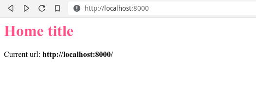

## Projet : une newsletter à la Substack

J'ai toujours aimé apprendre par l'exemple et ce guide ne dérogera pas à la règle. Nous allons prendre comme prétexte la création d'un projet pour apprendre à nous servir de FastAPI. Nous allons développer une application de [publication de contenu/newsletter à la Substack](https://substack.com/).

Les principales fonctionnalités que nous développerons :
- Création d'articles
- Envoi des articles par email
- Gestion des utilisateurs avec inscription et authentification

Plein de bonus possibles :
- Gestion du multilingue
- Traduction automatique des articles
- Commentaires sur les articles
- Conversion du contenu en audio

### Structure de notre projet FastAPI

À la différence de beaucoup de Framework, FastAPI n'impose __aucune structure de répertoires__ ou de fichiers pour pouvoir fonctionner. Quelques __conventions__ se dégagent cependant parmi tous les projets disponibles. Voici celle que nous allons adopter :

```
fastapi-beginners-guide/   <-- répertoire racine de notre projet
├── app/                   <-- répertoire contenant le code Python
│   ├── core/              <-- fichiers partagés (config, exceptions, …)
│   │   └── __init__.py
│   ├── __init__.py
│   ├── main.py            <-- point d'entrée de notre programme FastAPI
│   ├── models/            <-- les modèles de notre base de données
│   │   └── __init__.py
│   ├── schemas/           <-- les schémas de validation des modèles
│   │   └── __init__.py
│   ├── templates/         <-- fichiers html/jinja
│   ├── tests/             <-- tests
│   │   └── __init__.py
│   └── views/             <-- fonctions gérant les requêtes HTTP
│       └── __init__.py
├── public/                <-- fichiers CSS, Javascript et fichiers statiques
└── venv/                  <-- environnement virtuel créé à la partie 1
```

Créez une structure de répertoire identique à celle ci-dessus. Vous ne devriez pas avoir à créer le répertoire `venv` puisque il a du être créé automatiquement suite à la [partie 1](/articles/le-guide-complet-du-debutant-avec-fastapi-partie-1/). Les fichiers `__init__.py` sont des fichiers vides nécessaires pour que Python puisse considérer vos répertoires comme des packages.

Copie/collez le code de la partie 1 dans le fichier `app/main.py` :

```python
# app/main.py
from fastapi import FastAPI

app = FastAPI()


@app.get("/")
async def root():
    return {"message": "Hello World"}
```

Déplacez vous à la racine du projet puis activez l'environnement virtuel :

```
$ source ./venv/bin/activate
```

Assurez-vous ensuite que vous pouvez lancer `uvicorn` avec la commande suivante :


```
(venv) $ uvicorn app.main:app --reload
```

Le type de résultat attendu :

```
INFO:     Uvicorn running on http://127.0.0.1:8000 (Press CTRL+C to quit)
INFO:     Started reloader process [10884] using watchgod
INFO:     Started server process [10886]
INFO:     Waiting for application startup.
INFO:     Application startup complete.
```

Notez la différence avec la commande de la [partie 1](/articles/le-guide-complet-du-debutant-avec-fastapi-partie-1/) : nous avons rajouté un `app.` devant le `main`. Celui-ci correspond au répertoire `app/` que nous venons de créer dans lequel se situe notre fichier `main.py`. Je rappelle que le `app` situé après le `:` est le nom de l'objet FastAPI qui a été créé dans notre fichier `main.py`.

### Première page HTML

Nous allons maintenant créer la première page de notre « site web » avec de l'HTML et du CSS.

Copiez collez le code ci-dessous dans votre fichier `app/main.py`.

```python
# app/main.py
from fastapi import FastAPI, Request
from fastapi.staticfiles import StaticFiles
from fastapi.templating import Jinja2Templates

app = FastAPI()

app.mount("/static", StaticFiles(directory="public"), name="public")

templates = Jinja2Templates(directory="app/templates")


@app.get("/")
async def root(request: Request):
    return templates.TemplateResponse("home.html", {"request": request})
```

Décortiquons ce que nous venons de faire.

```python
app.mount("/static", StaticFiles(directory="public"), name="public")
```

Nous « _montons_ » (`app.mount`) une route qui va répondre à l'URL `/static` et qui servira, sous cette adresse, les fichiers que nous mettrons dans le répertoire `public/` précédemment créé (`directory="public"`). Nous nommons cette route `public` (`name="public"`), car nous aurons besoin de l'appeler par son nom pour nous en servir un peu plus loin. Toto aurait aussi fonctionné comme nom, mais c'est moins parlant 😉

__En résumé__ : Si nous plaçons un fichier nommé `styles.css` dans notre répertoire `public/`, cette route va nous permettre d'y accéder par l'adresse `http://localhost:8000/public/styles.css`.

```python
templates = Jinja2Templates(directory="app/templates")
```

Nous créons un objet (`templates`) qui va nous permettre de créer de l'HTML avec le moteur de templates [Jinja2](https://jinja2docs.readthedocs.io/en/stable/). Cet objet ira chercher ses templates dans le répertoire que nous avons créé, `app/templates/`.


```python
@app.get("/")
async def root(request: Request):
    return templates.TemplateResponse("home.html", {"request": request})
```

Nous avons ensuite modifié notre méthode `root` pour qu'elle récupère l'objet `request`. Cet objet est fourni par FastAPI (plus précisement par [starlette](https://www.starlette.io), Framework sur lequel FastAPI est basé) et permet d'obtenir des informations sur la requête : l'URL d'origine, les cookies, les headers, etc. La documentation complète est disponible ici : https://www.starlette.io/requests/. Nous y reviendrons.

Au lieu de retourner un simple dictionnaire Python comme précédemment, notre méthode renvoie maintenant un objet `TemplateResponse`. C'est un objet qui va être en charge de créer du HTML à partir d'un template, `home.html` dans notre cas. Il ira chercher ce template dans le répertoire que nous avons spécifié plus haut avec `directory="app/templates"`.

Notez le dictionnaire Python passé deuxième paramètre, `{"request": request}`. Ce dictionnaire va nous permettre de passer des données de notre vue à notre template. Dans ce cas précis, nous passons la requête en paramètre. La clé du dictionnaire `"request"` est le nom que nous voulons donner à notre valeur dans le template et la valeur du dictionnaire `request` est la valeur que nous souhaitons passer au template sous ce nom.

Il nous faut ensuite créer le contenu du template dans `app/templates/home.html`. Copiez-collez le code suivant :

```django
<!DOCTYPE html>
<html>
<head>
    <title>Home</title>
    <link href="{{ url_for('public', path='/styles.css') }}" rel="stylesheet">
</head>
<body>
    <h1>Home title</h1>
    <p>Current url: <strong>{{ request.url }}</strong></p>
</body>
</html>
```

Outre le code HTML classique, la première ligne intéressante est la suivante :
```django
<link href="{{ url_for('public', path='/styles.css') }}" rel="stylesheet">
```

Nous construisons un lien dynamique grâce à la fonction `url_for`. Cette fonction prend en paramètres le nom de la route, `public` dans notre cas (le nom que nous avions donné plus haut, lors du `app.mount`) et l'emplacement du fichier, `path='/styles.css'`, qu'il nous restera à créer. Avec Jinja, tout ce qui est entre `{{` et `}}` sera affiché dans le code HTML.

L'autre ligne intéressante est celle-ci :
```django
<p>Current url: <strong>{{ request.url }}</strong></p>
```
Ici nous nous servons de l'objet `request` de starlette que nous avions passé à notre template (`templates.TemplateResponse("home.html", {"request": request})`) pour afficher l'url courante.

Il nous reste à créer le fichier `styles.css` dans le répertoire `public/` et d'y mettre le contenu suivant par exemple :

```css
h1 {
  color: #fe5186;
}
```

Rechargez votre page d'accueil à l'adresse [http://localhost:8000/](http://localhost:8000/) et vous devriez obtenir le résultat suivant :



## Interaction avec la base de données : écriture des modèles avec Tortoise ORM

Maintenant que nous arrivons à afficher quelque chose, il est temps de passer à la création de nos __modèles de base de données__. Ces modèles sont des classes spéciales Python qui vont nous aider à créer/modifier/supprimer des lignes dans la base de données.

Il y a plusieurs façon d'interagir avec une base de données. La façon classique est d'écrire des __requêtes SQL__ directement par vous-même en fabricant vos propres `SELECT * FROM …` et autres `UPDATE … SET …`. C'est faisable, mais ce n'est pas ce que l'on voit le plus souvent et c'est assez fastidieux. Je vais ici vous présenter une autre approche : l'utilisation d'un _Object Relational Mapper_ (__ORM__). C'est ce que vous verrez dans quasiment tous les frameworks. Je ne rentrerai pas ici dans le débat sur l'efficacité ou non des ORM (car débat il y a) et j'adopterai juste une approche pragmatique : c'est ce que la majorité utilise, nous ferons donc pareil ici.

Pour faire simple, les ORMs font vous permettre de faire du SQL et de créer vos propres requêtes SQL __sans écrire une ligne de SQL__, juste en manipulant des objets Python classiques.

Il existe beaucoup d'ORMs différents en Python :
- L'[ORM de Django](https://docs.djangoproject.com/fr/3.2/topics/db/) lui est spécifique et ne peut pas être facilement utilisé en dehors de Django
- [SqlAlchemy](https://www.sqlalchemy.org/) est l'ORM standard de Python utilisé un peu partout. Il est très (trop ?) complet.
- [peewee](http://docs.peewee-orm.com/en/latest/) un ORM simple et donc facile à apprendre
- [Tortoise ORM](https://tortoise-orm.readthedocs.io/) est un ORM inspiré de Django mais qui utilise les dernières avancées de Python (comme FastAPI), notamment `asyncio`.

Mon choix s'est porté sur [Tortoise ORM](https://tortoise-orm.readthedocs.io/) car je trouve qu'il est développé dans le même esprit que FastAPI : __se baser sur ce qui était bien fait dans le passé__ (dans ce cas l'API de l'ORM de Django) tout en __modernisant l'approche__ (dans ce cas en utilisant les fonctionnalités asynchrones des dernières version de Python).

> Pour les besoins de ce guide, nous allons pour l'instant utiliser une base de données simple qui ne nécessite pas d'autres logiciels à installer : [SQLite](https://www.sqlite.org/index.html). Nous verrons plus tard lorsque nous passerons à _Docker_ comment utiliser une base de données bien plus robuste, à savoir [PostgreSQL](https://www.postgresql.org/).

### Installation de Tortoise

Soyez bien certain d'avoir activé votre environnement virtuel :

```
$ source ./venv/bin/activate
```

Puis installez Tortoise ORM.

```
(venv) $ pip install tortoise-orm
```

### Création des modèles

Nous allons ajouter un premier modèle à notre application. Ce modèle va représenter un article dans notre Newsletter. Il aura donc les champs classiques auxquels l'on pourrait s'attendre : titre, contenu, etc.

```python
from fastapi import FastAPI, Request
from fastapi.staticfiles import StaticFiles
from fastapi.templating import Jinja2Templates
from tortoise import fields
from tortoise.models import Model

app = FastAPI()

app.mount("/public", StaticFiles(directory="public"), name="public")

templates = Jinja2Templates(directory="app/templates")


class Articles(Model):

    id = fields.IntField(pk=True)

    title = fields.TextField()
    content = fields.TextField()

    created_at = fields.DatetimeField(auto_now_add=True)
    updated_at = fields.DatetimeField(auto_now=True)

    def __str__(self):
        return self.title


@app.get("/")
async def root(request: Request):

    return templates.TemplateResponse(
        "home.html",
        {
            "request": request
        })
```

Tout d'abord, nous importons les classes nécessaires de Tortoise :

```python
from tortoise import fields
from tortoise.models import Model
```

Ensuite, nous définissons notre modèle, que nous allons nommer `Article` et qui hérite des modèles (`Model`) par défaut de Tortoise :


```python
class Articles(Model):
```

Nous déclarons ici la clé primaire de notre modèle, de type `IntField`. Le `pk=True` va permettre de considérer le champs comme clé primaire (__p__rimarey __k__ey) et va générer la prochaine valeur automatiquement de manière incrémentale. Ce n'est pas quelque chose d'obligatoire puisque si nous ne le faisons pas, Tortoise créera un champ `id` automatiquement pour nous. Mais je préfère toujours le faire de manière explicite.

```python
    id = fields.IntField(pk=True)
```

Nous déclarons ensuite nos champs de contenu, qui sont tous les deux de type `TextField`.

```python
    title = fields.TextField()
    content = fields.TextField()
```

Je trouve toujours utile d'avoir la date de création de mes objets ainsi que leur dernière date de modification. Pour ce faire j'ai rajouté les deux champs `created_at` et `updated_at` qui seront automatiquement mis à jour par Tortoise :

```python
    created_at = fields.DatetimeField(auto_now_add=True)
    updated_at = fields.DatetimeField(auto_now=True)
```

Et pour finir, je surcharge la méthode Python par défaut `__str__`.

```python
    def __str__(self):
        return self.title
```

Il n'est pas obligatoire de surcharger la fonction `__str__` mais c'est une bonne pratique qui nous permettra de faciliter notre debug plus tard. Quand on demandera à afficher l'objet, cela affichera son titre au lieu d'une représentation incompréhensible interne à Python.
