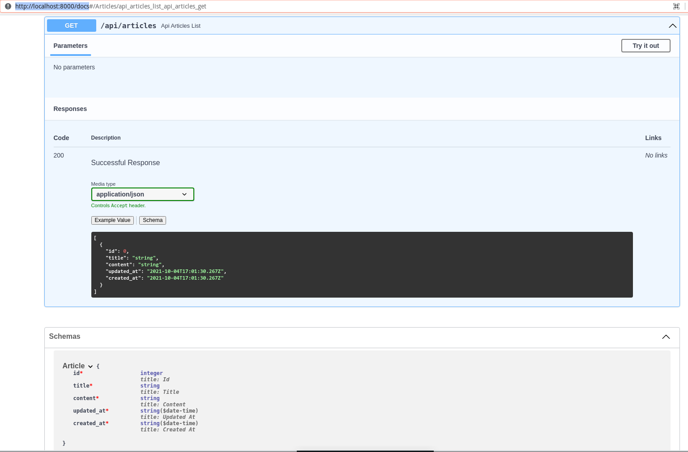

Dans cette partie, nous allons mettre en place l'API pour nous permettre de __récupérer__ les articles, les __créer__ de manière dynamique, les __modifier__ et les __supprimer__.Vous verrez souvent cela résumé par l'acronyme __CRUD__ : **C**reate, **R**retrieve, **U**pdate et **D**elete.

## Utilisation de Pydantic

Comme je vous l'avais mentionné dans l'instroduction, FastAPI a la particularité d'utiliser au maximum les [types de python](https://fastapi.tiangolo.com/python-types/) et plus particulièrement une librairie appelée [Pydantic](https://pydantic-docs.helpmanual.io/).

Pydantic se définit comme ceci :

> pydantic enforces type hints at runtime, and provides user friendly errors when data is invalid.

Pydantic va se servir des types que nous allons définir sur nos objets pour automatiquement faire plein de choses : valider les données que les utilisateurs nous envoient (s'il sait qu'on attend un entier et qu'on nous donne un string, il enverra une erreur lisible par un humain) et, entres autres, permettre de générer automatiquement la documentation de notre API.

Nous allons donc commencer par définir ce que l'on appelle un _schéma_ pydantic pour notre classe `Article`. Commencez par créer le répertoire `app/schemas` :

```bash
mkdir app/schemas
```

Puis ajoutez-y un fichier nommé `article.py` avec le code suivant :

```python
# app/schemas/article.py

from pydantic import BaseModel
from datetime import datetime


class Article(BaseModel):
    id: int
    title: str
    content: str
    updated_at: datetime
    created_at: datetime
```

Vous voyez ici qu'on reproduit la structure de notre modèle article qui se trouve dans `app/models/article.py` presque à l'identique, en spécifiant le type de chaque champ.

> Il existe une [fonctionnalité de Tortoise](https://tortoise-orm.readthedocs.io/en/latest/contrib/pydantic.html) qui vous permet de générer le schéma Pydantic directement à partir du modèle. Nous ne l'utiliserons pas dans ce tutorial pour que vous puissiez voir comment cela fonctionne sans _magie_.

Nous pouvons déjà tirer bénéfice de ce nouvel ajout en spécifiant le type de retour que l'on attend dans nos vues. Cela va nous permettre d'avoir une première version de notre documentation. Dans notre fichier `app/views/article.py`, nous allons spécifier le type de retour de la fonction `api_articles_list`.

Commencez par y ajouter les deux imports suivants :

```python
# app/views/article.py
# … début des imports
from app.schemas.article import Article as ArticleSchema
from typing import List

# … reste du fichier
```

Puis modifiez le décorateur de la fonction en rajoutant le paramètre `response_model`, comme ceci :

```python
# app/views/article.py
# … début du fichier

@articles_views.get("/api/articles", response_model=List[ArticleSchema])
async def api_articles_list():

    articles = await Article.all().order_by('created_at')

    return articles
```

L'appel à votre API devrait toujours vous retourner la même chose (`http http://localhost:8000/api/articles`), c'est à dire la liste des articles. En revanche, vous avez gagné un bout de documentation gratuite. Rendez-vous sur [http://localhost:8000/docs](http://localhost:8000/docs) et vous devriez avoir quelque chose qui ressemble à cela :

[](images/docs_articles_list.png)

Vous pouvez maintenant voir que l'utilisateur de votre API est au courant du format de votre objet article et des types qu'il contient. Pratique !

## Création d'un article

Comme nous venons de le voir, Pydantic peut être utilisé pour spécifier à FastAPI quel type nous souhaitons retourner. Il peut être utilisé de la même manière pour spécifier à FastAPI les données d'entrée qu'attend notre API.

Dans le cas de la création d'un article par exemple, nous allons avoir uniquement besoin de son titre et de son contenu. Les champs `id`, `created_at` et `updated_at` sont des champs qui seront automatiquement générés à la création de l'article en base de données.

Voici donc le schéma Pydantic dont nous aurions besoin pour valider un objet qui permettra de créer un Article :

```python
class ArticleCreate(BaseModel):
    title: str
    content: str
```

Seuls le titre et le contenu sont requis. Les plus perspicaces d'entre vous aurons remarqué que cela fait un peu doublon avec le schéma `Article` que nous avons précédemment créé. Nous allons donc réorganiser un peu notre fichier `app/schemas/article.py` de la manière suivante :

```python
from pydantic import BaseModel
from datetime import datetime


class ArticleBase(BaseModel):
    title: str
    content: str


class Article(ArticleBase):
    id: int
    updated_at: datetime
    created_at: datetime


class ArticleCreate(ArticleBase):
    pass
```

J'ai créé une classe de base `ArticleBase` qui contient les champs qui seront partagés entre mon article général `Article` et mon article en création `ArticleCreate`. Les deux héritent donc de la classe de base, `ArticleBase`. Puisque mon article en création n'a pas d'autres membres, son contenu est juste `pass`. J'aurais pu n'avoir que deux schémas, un `ArticleCreate` contenant `title` et `content` et un `Article` héritant d'`ArticleCreate`. Mais je trouve cela plus clair de faire comme je l'ai fait et c'est une convention que vous trouverez dans pas mal de projets FastAPI.

Modifions maintenant la vue qui permet de créer un article dans `app/views/articles.py`. Notre vue actuelle créeait un article _en dur_ dans la base de données en utilisant une requête HTTP _GET_ et affichait l'article créé dans une page web.

```python

# Code actuel quelque part dans app/views/articles.py

@articles_views.get("/articles/create", include_in_schema=False)
async def articles_create(request: Request):

    article = await Article.create(
        title="Mon titre de test",
        content="Un peu de contenu<br />avec deux lignes"
    )

    return templates.TemplateResponse(
        "articles_create.html",
        {
            "request": request,
            "article": article
        })
```

Modifions cette fonction de la manière suivante :


```python
@articles_views.post("/articles",
                     response_model=ArticleSchema)
async def api_articles_create(article_create: ArticleCreate):

    article = await Article.create(
        title=article_create.title,
        content=article_create.content
    )

    return article
```

N'oubliez pas de mettre à jour la ligne d'import pour y ajouter notre schéma `ArticleCreate` comme ceci :

```python
from app.schemas.article import Article as ArticleSchema, ArticleCreate
```

Nous avons fait plusieurs choses :
- Modifié le type de méthode HTTP pour appeler notre fonction. Dans une API, le verbe HTTP à utiliser lors de la création d'un objet est POST.
- Changé l'adresse de l'URL. Nous n'avons pas besoin d'ajouter le `/create`. Le fait que la méthode soit accessible via l'URL `/articles` avec la méthode POST induit que c'est la méthode qui sert à créer un article.
- Inclu la méthode dans la documentation en enlevant le `include_in_schema=False`
- Spécifié le modèle de retour `ArticleSchema` : nous retournerons l'article créé à la fin de la méthode.
- Renommé la méthode `articles_create` en `api_articles_create`.
- Spécifié que cette méthode nécessitaint un objet `article_create` de type `ArticleCreate` en paramètre.
- Utilisé le contenu de l'objet `article_create` passé en paramètre pour créer l'objet en bases de données.
- Retourné l'article créé (en JSON par défaut).

Pour comprendre comment cela marche, essayons d'envoyer une simple requête POST sans aucun paramètre :

```
http POST http://localhost:8000/articles
```

Vous devriez obtenir une réponse de type 422 (Unprocessable Entity) avec le contenu suivant :

```json
{
    "detail": [
        {
            "loc": [
                "body"
            ],
            "msg": "field required",
            "type": "value_error.missing"
        }
    ]
}
```

FastAPI nous signifie ici qu'il s'attend à avoir un contenu (_body_) mais que nous n'en avons pas passé. Notez le beau message d'erreur formatté en JSON facilement lisible.
Puisque nous avons dit à FastAPI qu'il devait recevoir un objet de type `ArticleCreate` en paramètres, il s'attend à ce que nous lui envoyons un json avec les champs qui représentent l'objet `ArticleCreate`, c'est à dire `title` et `content`. Il s'attend donc à recevoir un JSON qui a cette tête là :

```json
{
  "title": "Titre de test",
  "content": "Contenu de test"
}
```

Utilisons _httpie_ pour lui envoyer ce qu'il attend :

```
http POST http://localhost:8000/articles title="Titre de test" content="Contenu de test"
```

Notez que _httpie_ construit automatiquement un objet JSON avec les paramètres qu'on lui passe après l'URL. Vous devriez alors obtenir une réponse de ce style :

```json
{
    "content": "Contenu de test",
    "created_at": "2021-10-05T12:29:06.897552+00:00",
    "id": 16,
    "title": "Titre de test",
    "updated_at": "2021-10-05T12:29:06.897572+00:00"
}
```

Et que ce passe-t-il si on ne lui envoie qu'une partie de ce qu'il attend ? Essayons en n'envoyant que le titre par exemple :

```
http POST http://localhost:8000/articles title="Titre de test"
```

Vous obtenez de nouveau une erreur qui vous dit qu'un champ est manquant :

```json
{
    "detail": [
        {
            "loc": [
                "body",
                "content"
            ],
            "msg": "field required",
            "type": "value_error.missing"
        }
    ]
}
```

Notez qu'il est capable de nous dire que ce champ manquant est à l'emplacement `body`>`content`.

Grâce à Pydantic et à la définition de notre schéma `ArticleCreate` nous obtenons donc gratuitement :
- La validation des paramètres de la requête
- La création d'un objet valide de type `ArticleCreate` dans notre vue
- La [documentation de notre méthode POST](http://localhost:8000/docs#/Articles/articles_create_articles_post)
