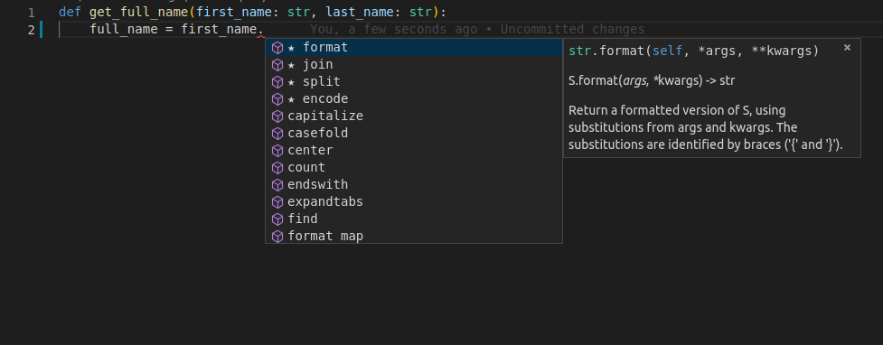
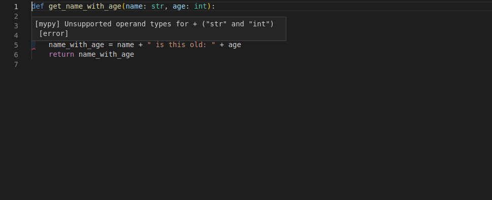
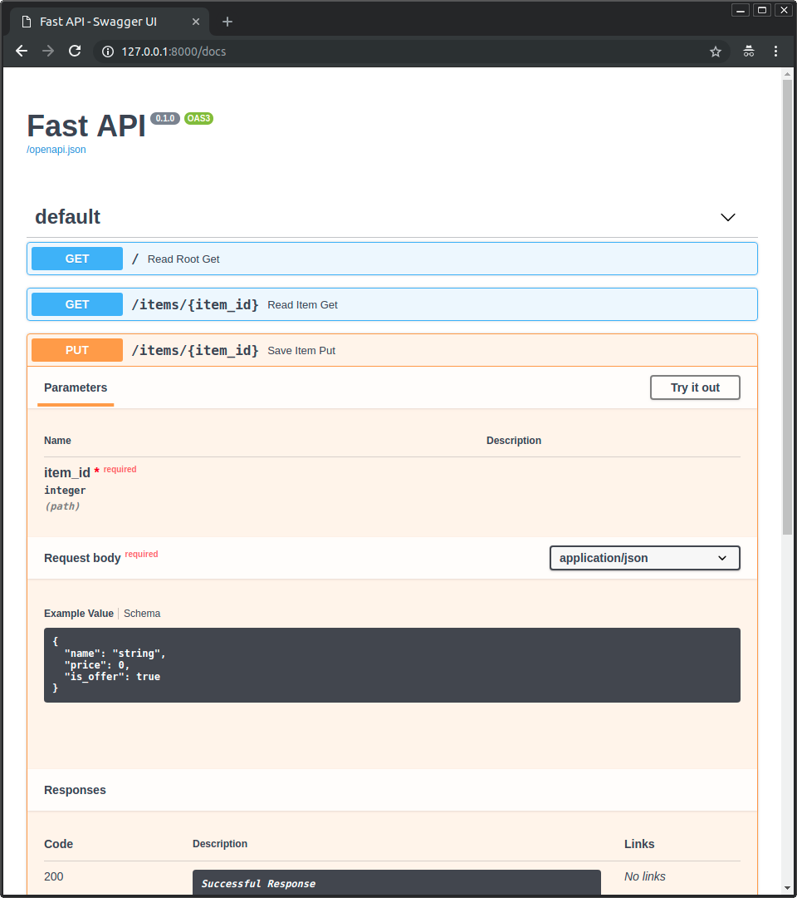

Oui ce titre est racoleur, oui il fait preuve d'une opinion totalement biaisée. Mais bordel, quand quelque chose est __bien__, il faut le dire ! Quitte à utiliser de falacieux moyens dignes du meilleur _growth hacker_, à savoir, je vous le donne en mille : le titre putaclick.

Passée cette intro de qualité, venons-en aux faits : [FastAPI](https://fastapi.tiangolo.c) est le meilleur framework Web Python que j'ai pu utiliser depuis de nombreuses années, loin devant __Django__, __DRF__, __Flask__ ou autres __Pyramid__.

## Sur les épaules des géants

On pourrait se dire, mais pourquoi encore un framework de plus ? C'est justement ce que j'aime chez FastAPI, ce n'est __pas juste un Framework de plus__. Sa conception a été __réfléchie__, __documentée__, et __est construit sur l'existant__. Il y a même [une page complète qui explique la démarche](https://fastapi.tiangolo.com/alternatives/) et ce qui a été pris des différents frameworks existants et pourquoi.

> FastAPI wouldn't exist if not for the previous work of others.
>
> There have been many tools created before that have helped inspire its creation.
>
> I have been avoiding the creation of a new framework for several years. First I tried to solve all the features covered by FastAPI using many different frameworks, plug-ins, and tools.
>
> But at some point, there was no other option than creating something that provided all these features, __taking the best ideas from previous tools__, and combining them in the best way possible, using __language features that weren't even available before__ (Python 3.6+ type hints).

Et pour chaque framework/outil il y a une explication de ce qui a été gardé pour FastAPI.


C'est pour moi un __point très important__ : c'est un Framework qui a été __pensé__, __réfléchi__ et qui est __construit sur ce qui existe déjà__.

## À la pointe des évolutions de Python

Qu'on aime ou pas Python a, ces dernières années, intégré deux évolutions majeures :
- La __programmation asynchrone__ avec _asyncio_
- Un début de __typage__ avec les _typehints_

Pour faire simple, la programmation asynchrone va permettre à des programmes Python de faire __plus de choses en même temps__, sans être obligé d'attendre que certaines tâches soient finies pour passer à d'autres. Vous l'avez naturellement dans Node.JS, Go, Rust (plus récemment) et donc maintenant Python. Pour plus d'explications, n'hésitez pas à aller lire [cet article sur Zeste de savoir](https://zestedesavoir.com/articles/1568/decouvrons-la-programmation-asynchrone-en-python/).

Les _typehints_ quant à eux, vont __aider le compilateur__ et donc vous, par la même occasion, à savoir ce que vous voulez faire de votre programme. Ci-dessous par exemple, on spécifie que la fonction `greeting` doit prendre une chaîne de caractères (`str`) en paramètre. Si vous lui donnez ce qu'il sait être un `int`, le compilateur vous en informera.

```python
def greeting(name: str) -> str:
    return 'Hello ' + name
```

PHP a fait cette mutation il y a quelques années, javascript/typescript aussi, et c'est donc maintenant aussi le cas de Python depuis la version 3.6. On pourrait débattre des heures sur le typage des langages de programmation dynamiques, mais ce n'est pas le sujet ici.

Le sujet est que __FastAPI l'utilise partout__, l'encourage [dans sa documentation](https://fastapi.tiangolo.com/python-types/) et par l'utilisation de [Pydantic](https://pydantic-docs.helpmanual.io/) pour valider vos données.

Cela va permettre :

- À votre éditeur de code de vous afficher la __complétion des méthodes__



- À votre éditeur de code de vous __afficher des erreurs utiles__



- À __vos modèles d'être validés automatiquement__, c'est à dire de savoir si les données que vous lui soumettez sont valides ou non, juste en utilisant la déclaration des types
- Générer __automatiquement la documentation OpenAPI__ de votre API


[Documentation officielle python](https://docs.python.org/3/library/typing.html)
[Cheat sheet mypy](https://mypy.readthedocs.io/en/latest/cheat_sheet_py3.html)

## Orienté API, mais pas que

De plus en plus, dès que vous avez une application web (avec un framework javascript en front) ou mobile à faire, tout ce dont vous avez besoin, c'est une __API Json__. FastAPI est __parfait__ pour ça. Vraiment. Beaucoup plus simple que DRF, pas besoin d'apprendre je ne sais quelle syntaxe pour transformer vos objets en JSON, tout est simple et utilisable tel quel (notamment grâce à _Pydantic_ et les _typehints_).


```python
from typing import Optional

from fastapi import FastAPI
from pydantic import BaseModel

app = FastAPI()


class Item(BaseModel):
    name: str
    price: float
    is_offer: Optional[bool] = None


@app.get("/")
def read_root():
    return {"Hello": "World"}


@app.get("/items/{item_id}")
def read_item(item_id: int, q: Optional[str] = None):
    return {"item_id": item_id, "q": q}


@app.put("/items/{item_id}")
def update_item(item_id: int, item: Item):
    return {"item_name": item.name, "item_id": item_id}
```

Et avec ça vous avez en plus une documentation auto-générée.



Je ne vais pas rentrer dans les détails, vous pourrez les trouver sur [le site web de FastAPI](https://fastapi.tiangolo.com/). Mais vraiment, si vous avez une __API Json à faire, ne cherchez pas plus loin__.

Et si je dois faire un __site internet « classique »__ ? Et bien ça se fait très bien aussi. J'ai personnellement réalisé un site avec :
- Pour __écrire mon HTML__ : [Jinja](https://fastapi.tiangolo.com/advanced/templates/) comme moteur de template (le même que Django)
- Pour __gérer mes formulaires__ : le classique [WTForms](https://wtforms.readthedocs.io/en/2.3.x/) beaucoup utilisé avec Flask et notamment son intégration avec [starlette](https://www.starlette.io/) (sur lequel est basé FastAPI), nommée [starlette-wtf](https://github.com/muicss/starlette-wtf).
- Pour la __gestion des utilisateurs__ : [fastapi-users](https://github.com/frankie567/fastapi-users)
- Pour __la base de données__ : [Tortoise ORM](https://tortoise-orm.readthedocs.io/en/latest/). C'est moins le bazar que SQLAlchemy (totalement subjectif), c'est asynchrone par défaut et ça marche très bien avec `fastaupi-users`.
- Pour __les migrations__ : [Aerich](https://github.com/tortoise/aerich). C'est fait par les développeurs de Tortoise et ça fait très bien le taf.

## Simple, efficace et plein de fonctionnalités

FastAPI combine pour moi le meilleur de tous les mondes :
- __Léger__ comme _Flask_
- __Rapide__ comme _Go_ ou _Node.js_
- __Fait pour les API__ comme _DRF_
- Parfait pour les __Websockets__
- __Typé__ pour se faire aider par le compilateur
- Basé sur les __dernières avancées de Python__
- __Facile__ à prendre en main

Voici une liste à la Prévert de ses fonctionnalités issues du [site web de FastAPI](https://fastapi.tiangolo.com/features/):

- Respecte des __standards ouverts__ : [OpenAPI](https://github.com/OAI/OpenAPI-Specification) & [JSON Schema](https://json-schema.org/)
- __Génère automatiquement la documentation__ et permet l'exploration via des interfaces web avec [Swagger UI](https://github.com/swagger-api/swagger-ui) et [ReDoc](https://github.com/Rebilly/ReDoc)
- Se base sur du __Python 3.6+ standard__, sans autre nouvelle syntaxe à apprendre
- Permet de la __complétion de code__ (grâce aux types) dans les éditeurs classiques comme [Visual Studio Code](https://code.visualstudio.com/) ou [PyCharm](https://www.jetbrains.com/pycharm/)
- __Fonctionne par défaut__ mais peut être entièrement configuré de manière optionnelle
- A des fonctionnalités de __validation__ pour les types Python par défaut, mais aussi pour des types plus exotiques comme _URL_, _email_, _UUID_, etc.
- Intègre des __mécanismes de sécurité par défaut__ : HTTP Basic, __OAuth2 & JWT Tokens__, __cookies de session__, clés d'API supportées dans les Headers, les paramètres de requêtes et les cookies
- Dispose d'un mécanisme d'__injection de dépendance__ très facile à utiliser qui va vous permettre de disposer des objets dont vous avez besoin dans vos méthodes très facilement (comme la connexion à la base de données). Et je confirme, ça fait du bien cette simplicité après avoir du subir^W^W^W^Wgérer ça en _Symfony/PHP_ :sweat_smile:
- Ne nécessite __pas de plugins__ en particulier, et pour cause : il suffit just d'importer du code Python et de l'utiliser tel quel
- __Testé__ : couverture de test de 100%, base de code annotée avec des types à 100%, utilisé en production

FastAPI étant [basé sur Starlette](https://www.starlette.io/), il dispose aussi de toutes ses fonctionnalités :

- __Performances impressionnantes__. Un des [frameworks python le plus rapide, faisant jeu égal avec __NodeJS__ et __Go__](https://github.com/encode/starlette#performance).
- Support des __Websocket__
- Support de __GraphQL__
- Exécution de __tâches de fond__
- Évènements de startup/shutdown
- Client de test basé sur [`requests`](https://docs.python-requests.org/en/master/)
- __CORS__, GZip, fichiers statiques et réponses en streaming
- Support des __sessions et des cookies__


## Conclusion

Clairement, pour moi, si je devais commencer un projet __web de type API en python__, choisir __FastAPI me paraitrait être une évidence__. Il est __moderne__, __rapide__ et développé par quelqu'un qui __réfléchit__ avant de coder.

Si je devais commencer un __projet web plus classique__ avec besoin de templating, de formulaires, etc. je partirais __aussi sur FastAPI__. Il permet tout ça très bien avec une touche de __modernité et de simplicité__ qui est la bienvenue.

Si en revanche vous avez absolument __besoin de l'admin Django__, partir avec __FastAPI n'est pas forcément une bonne idée__. Même s'il existe une libraire [d'administration FastAPI](https://fastapi-admin-docs.long2ice.cn/) elle est assez récente et n'a rien à voir avec celle de Django. Dans ce cas là ça vaut quand même le coup de se poser la question : est-ce que vous avez vraiment besoin de l'admin ? Il est des fois plus rapide de re-développer soi-même que de passer du temps à configurer un truc déjà tout prêt.

Quoiqu'il en soit, FastAPI est le framework Python qui m'a le plus impressionné depuis des années. Pour moi, __l'essayer, c'est l'adopter__ ! Pour commencer, vous pouvez [suivre le tutorial du site web officiel](https://fastapi.tiangolo.com/tutorial/).

Sinon, je vous prévois une suite d'articles de blog avec des exemples pas à pas. Stay tuned ! :tada:
